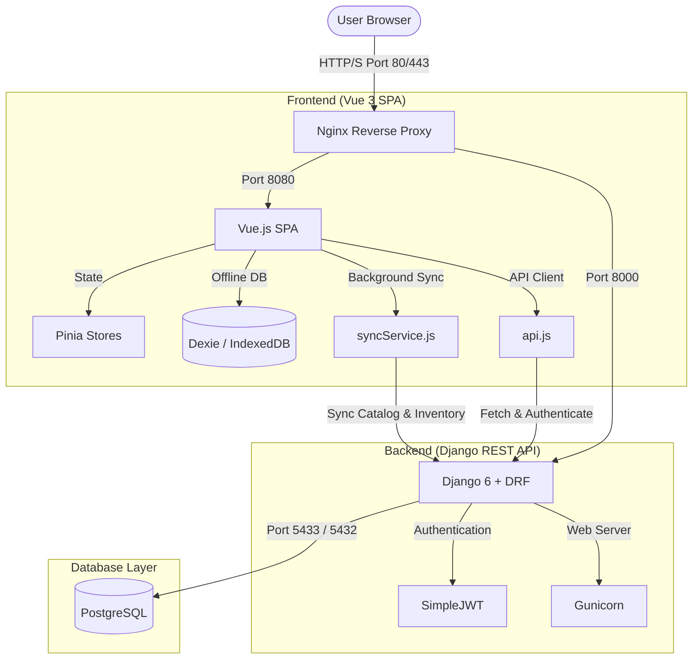

# Homepoint POS

Homepoint is an offline-first Point of Sale (POS) system built for hardware stores. It provides a responsive Vue 3 frontend and a Django 6 backend with PostgreSQL, supporting inventory, variants, orders, payments and offline synchronization.

## Key Features

- Offline-first frontend with IndexedDB (Dexie) sync
- Vue 3 + Pinia state management, TailwindCSS + PrimeVue UI
- Django 6 REST API (DRF) with SimpleJWT auth
- Role-based access control (admin, staff, cashier, customer)
- Product/Variant/Inventory model with unit and tax types
- Docker-based development for reproducible environments

## Architecture Overview

Homepoint POS uses an offline-first, containerized architecture that decouples frontend presentation and offline synchronization from the backend transactional APIs.

### 1. Frontend Architecture (Offline-First)
* **Framework:** Vue 3 Composition API with Vite, styled via PrimeVue component library and TailwindCSS.
* **State Management:** Pinia stores manage cart, checkout, local settings, and user session states.
* **Offline Database:** Dexie.js provides a clean wrapper around browser IndexedDB. Product catalog, pricing variants, and current inventory quantities are cached client-side.
* **Background Sync (`syncService.js`):** A synchronization engine runs on a 5-minute interval (when online and authenticated) to fetch delta updates from the backend and update the local Dexie database.
* **API Client (`api.js`):** Uses standard Fetch wrapped with automatic interceptors for JWT token attachment, 401 token refresh handling (using the unprivileged refresh token), and a strict 30-second request timeout limit.

### 2. Backend Architecture (REST API)
* **Framework:** Django 6 and Django REST Framework (DRF) serving REST endpoints.
* **Authentication:** SimpleJWT provides OAuth2-like JWT pairs.
  * **Access Token:** Valid for 15 minutes (stored in frontend memory/localStorage).
  * **Refresh Token:** Valid for 4 hours. Expired refresh tokens trigger automatic client logouts.
  * **Custom Auth Backend:** `users.backends.EmailOrUsernameModelBackend` handles login lookups seamlessly across either usernames or email addresses.
* **Role-Based Access Control (RBAC):** Users are assigned roles (`admin`, `staff`, `cashier`, `customer`). Rules are enforced on both backend endpoints (via Django permissions) and frontend routing (via Vue Router navigation guards: `requireAuth`, `requireRole`, `guestOnly`).

### 3. Database Layer
* **DBMS:** PostgreSQL 17 (hosted in docker on port 5433 in development).
* **Key Relations:**
  * `Product` has many `Variant` models (tracking sizes, lengths, etc.).
  * Each `Variant` maps to an `Inventory` record.
  * Pricing displays format dynamically based on `Variant.unit_type` (`piece`, `meter`, `kg`, `sqm`).
  * Tax computations are dynamically determined by `Variant.tax_type` (`A` = 16% VAT, `B` = 0%, `C` = exempt) for tax compliance (e.g. eTIMS).

### 4. Hybrid Deployment & Port Configuration
* **Docker Security Compliant:** The frontend container runs Nginx on a non-privileged port (`8080`) and drops privileges to `USER nginx`. 
* **Dynamic Configuration:**
  * **Docker runtime deployments (Scenario A):** The container entrypoint (`entrypoint.sh`) dynamically populates `window.config` inside `config.js` at runtime using environment variables.
  * **S3 static hosting (Scenario B):** S3 hosting serves compiled assets directly. The frontend falls back to build-time variables baked in during the GitHub Actions workflow, thanks to an empty fallback target in `public/config.js`.

## Data Model Highlights

- Product -> Variant -> Inventory
  - variant.unit_type: `piece`, `meter`, `kg`, `sqm` — affects pricing and UI
  - variant.tax_type: `A` (16% VAT), `B` (0%), `C` (exempt)
  - Inventory is tracked per variant to allow multi-unit products

- Order lifecycle: `pending` → `paid` → `delivered` (or `cancelled`)

## Authentication & Roles

- JWT stored in localStorage (`jwt_token`, `refresh_token`) with automatic refresh in the API client
- Roles enforced in frontend route guards (`requireAuth`, `requireRole`, `guestOnly`) and backend permissions

## Development

Prerequisites: Docker & Docker Compose, Node 18+ (for local frontend work), Python 3.11+ (for local backend work)

Top-level Makefile commands (recommended for local development using Docker Compose):

- `make up` — start all services (frontend:5173, backend:8000, db:5433)
- `make down` — stop services
- `make logs` — view combined logs
- `make shell-backend` — open a shell inside the Django container
- `make migrate` — run migrations inside the backend container

Frontend (inside homepointFrontend/):

- `npm run dev` — start Vite dev server
- `npm run build` — production build
- `npm run test:unit` — run Vitest unit tests
- `npm run lint` — run ESLint (auto-fix enabled)
- `npm run format` — run Prettier on src/ (experimental)

Backend (inside homepointBackend/):

- `python manage.py test` — run Django tests
- `python manage.py makemigrations` — create migrations
- `python manage.py migrate` — apply migrations

## Environment

- Root `.env` controls Docker-compose variables
- Frontend uses `homepointFrontend/.env` with at least `VITE_API_BASE_URL`
- Backend requires `DJANGO_SECRET_KEY`, DB credentials and MPesa variables for payments if enabled

## Offline Sync Behavior

- Frontend syncs products/variants/inventory to IndexedDB every 5 minutes
- Sync stops when user logs out; sync requires authentication
- Sync status is shown in the navbar (online/offline indicator)

## Testing & Quality

- Frontend unit tests: Vitest + jsdom
- Backend tests: Django test runner
- Linting: ESLint configured for frontend (run `npm run lint` before commits)

## Contributing

- Follow existing code style and tests
- Run frontend linting and backend tests before submitting PRs
- Describe any database migrations or environment changes in PR descriptions

## Troubleshooting & Gotchas

- PostgreSQL runs on port 5433 (not 5432) in development
- Path alias `@` maps to `src/` in the frontend (configure your editor accordingly)
- SimpleJWT token refresh is implemented in `src/services/api.js`; inspect it if you see unexpected 401s

## Useful Links

- Admin: `/admin/`
- API docs / Swagger: `/swagger/` (if enabled)

---

If additional sections or examples are needed (architecture diagram, quick start, API examples), indicate which and a more detailed README will be added.
